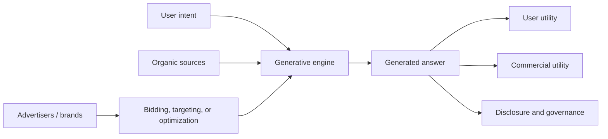

# Awesome Generative Advertising & GEM Research

[](https://awesome.re)
[](https://arxiv.org/abs/2509.14221)
[](CONTRIBUTING.md)

A curated research map for **generative advertising**, **AI search monetization**, **LLM-native advertising**, **Generative Engine Marketing (GEM)**, **Ad-Injected Response (AIR) generation**, **Generative Engine Optimization (GEO)**, sponsored LLM responses, ad auctions for LLMs, and trust/disclosure in commercial generative systems.

Last reviewed: **2026-07-04**.

## Contents

- [Field Thesis](#field-thesis)
- [Scope](#scope)
- [A Working Taxonomy](#a-working-taxonomy)
- [Canonical Anchors](#canonical-anchors)
- [Paper List](#paper-list)
  - [1. Generative Search, GEO, And Consumer Discovery](#1-generative-search-geo-and-consumer-discovery)
  - [2. LLM-Generated Advertising Content](#2-llm-generated-advertising-content)
  - [3. LLM-Native Ads And AIR Generation](#3-llm-native-ads-and-air-generation)
  - [4. Auctions, Mechanisms, And Monetization](#4-auctions-mechanisms-and-monetization)
  - [5. Detection, Disclosure, Trust, And Governance](#5-detection-disclosure-trust-and-governance)
  - [6. Brand Competition, Bias, And Manipulation](#6-brand-competition-bias-and-manipulation)
- [How To Cite The Field](#how-to-cite-the-field)
- [Open Problems](#open-problems)
- [Industry Signals](#industry-signals)
- [Contributing](#contributing)

## Field Thesis

Advertising in generative AI is not just "ads next to chatbot answers." It is a new commercial layer in which user intent, retrieval, ranking, generation, recommendation, persuasion, disclosure, and auction mechanisms can all affect the final answer.

Traditional online advertising separated the commercial unit from the organic unit: a sponsored link, banner, search ad, product card, or ranked slot. Generative systems blur that separation. An LLM can mention a product, frame a recommendation, rewrite a comparison, retrieve sponsored context, or produce a fully ad-injected response. This shifts advertising from **slot allocation** to **commercial influence over generated outputs**.

This repo tracks that emerging field.

## Scope

Included:

- generative engine optimization and AI search visibility;
- LLM-generated ad creatives and personalized persuasion;
- LLM-native advertising and sponsored LLM responses;
- ad-injected response generation and evaluation;
- auctions and mechanism design for LLM outputs;
- datasets, benchmarks, and metrics for generative advertising;
- disclosure, native-ad detection, consumer trust, and governance;
- brand competition and recommendation bias in LLM systems.

Out of scope unless directly connected:

- generic digital marketing with no generative system;
- generic recommender systems with no LLM/generative interface;
- generic LLM agents with no commercial, advertising, search, recommendation, or monetization component.

## A Working Taxonomy

The field is still naming itself. A useful way to organize it is by where commercial influence enters the generative stack.

| Layer | Question | Representative Terms |
| --- | --- | --- |
| Discovery | Which sources, brands, products, or publishers become visible in generated answers? | GEO, AI search visibility, brand recommendation |
| Creative | Can LLMs generate persuasive ad copy, sponsored language, or personalized creatives? | LLM-generated ads, GenAI ads, personalization |
| Native Response | How are ads integrated into the generated answer itself? | LLM-native advertising, AIR generation, sponsored responses, GEM |
| Market Mechanism | How should advertisers bid and how should platforms allocate influence? | LLM ad auctions, mechanism design, monetization |
| Measurement | How do we evaluate user utility, ad utility, response quality, cost, and noticeability? | benchmarks, datasets, LLM-as-judge, human studies |
| Governance | Can users detect, contest, understand, or opt out of commercial influence? | disclosure, trust, native ad detection, consumer protection |



## Canonical Anchors

These papers are useful entry points into different parts of the field.

| Anchor | What It Anchors | Link |
| --- | --- | --- |
| **GEO: Generative Engine Optimization** | Visibility in generative engines | [arXiv:2311.09735](https://arxiv.org/abs/2311.09735) |
| **Online Advertisements with LLMs** | Early LLM advertising framework | [arXiv:2311.07601](https://arxiv.org/abs/2311.07601) |
| **GEM-Bench** | Benchmarking AIR generation in GEM | [arXiv:2509.14221](https://arxiv.org/abs/2509.14221) |
| **Ad Auctions for LLMs via RAG** | RAG-based ad auctions | [arXiv:2406.09459](https://arxiv.org/abs/2406.09459) |
| **Ads that Talk Back / GenAI Advertising** | User perception of personalized chatbot ads | [arXiv:2409.15436](https://arxiv.org/abs/2409.15436) |
| **LLM-Auction** | Generative auction for LLM-native ads | [arXiv:2512.10551](https://arxiv.org/abs/2512.10551) |
| **NaiAD** | Large-scale LLM-native advertising data | [arXiv:2605.09918](https://arxiv.org/abs/2605.09918) |
| **Trustworthy Commercial Intervention** | Governance framing for generative AI ads | [arXiv:2605.18673](https://arxiv.org/abs/2605.18673) |

## Paper List

### 1. Generative Search, GEO, And Consumer Discovery

This line studies how generative engines change search, discovery, and visibility. It is the upstream layer for commercial influence: before an ad is injected, a system must decide what sources and brands are surfaced.

| Year | Paper | Role |
| --- | --- | --- |
| 2023 | [Comparing Traditional and LLM-based Search for Consumer Choice](https://arxiv.org/abs/2307.03744) | Studies LLM-based search as a consumer decision interface, including speed, satisfaction, and overreliance risks. |
| 2023/2024 | [GEO: Generative Engine Optimization](https://arxiv.org/abs/2311.09735) | Introduces GEO and GEO-bench for improving content visibility in generative engine responses. |
| 2025 | [Generative Engine Optimization: How to Dominate AI Search](https://arxiv.org/abs/2509.08919) | Expands the practical and strategic framing of AI search visibility. |
| 2026 | [Incumbent Advantage: Brand Bias and Cognitive Manipulation Dynamics in LLM Recommendation Systems](https://arxiv.org/abs/2606.17443) | Shows how brand familiarity, rating gaps, authority language, and multi-brand GEO competition shape LLM recommendations. |

### 2. LLM-Generated Advertising Content

This line studies LLMs as creative generators for ads and persuasion, even when the ad is not embedded in a chatbot response.

| Year | Paper | Role |
| --- | --- | --- |
| 2025 | [LLM-Generated Ads: From Personalization Parity to Persuasion Superiority](https://arxiv.org/abs/2512.03373) | Compares LLM-generated ad creatives against human-written ads under personalization and persuasion principles. |
| 2024/2025 | [Ads that Talk Back / GenAI Advertising: Risks of Personalizing Ads with LLMs](https://arxiv.org/abs/2409.15436) | Builds chatbot ads and studies how personalization, disclosure, and hidden sponsored content affect users. |

### 3. LLM-Native Ads And AIR Generation

This is the response-generation layer: the ad is not merely adjacent to the answer; it is part of the generated answer.

| Year | Paper | Role |
| --- | --- | --- |
| 2025/2026 | [GEM-Bench: A Benchmark for Ad-Injected Response Generation within Generative Engine Marketing](https://arxiv.org/abs/2509.14221) | Defines AIR generation in GEM and provides datasets, metric ontology, baselines, and a multi-agent evaluation framework. |
| 2026 | [Ad Insertion in LLM-Generated Responses](https://arxiv.org/abs/2601.19435) | Proposes decoupling organic response generation from disclosed ad insertion, using genre-level bidding. |
| 2026 | [NaiAD: Initiate Data-Driven Research for LLM Advertising](https://arxiv.org/abs/2605.09918) | Builds a large-scale LLM-native advertising dataset with user and commercial utility labels. |

### 4. Auctions, Mechanisms, And Monetization

This line studies how platforms should allocate commercial influence when the auction object is no longer a fixed slot but a generated response or distribution over responses.

| Year | Paper | Role |
| --- | --- | --- |
| 2023 | [Online Advertisements with LLMs: Opportunities and Challenges](https://arxiv.org/abs/2311.07601) | Frames LLM advertising around modification, bidding, prediction, and auction modules. |
| 2024 | [Truthful Aggregation of LLMs with an Application to Online Advertising](https://arxiv.org/abs/2405.05905) | Introduces MOSAIC, a truthful mechanism for aggregating advertiser preferences over LLM-generated replies. |
| 2024 | [Ad Auctions for LLMs via Retrieval Augmented Generation](https://arxiv.org/abs/2406.09459) | Designs segment auctions where ads are retrieved into LLM outputs according to bid and relevance. |
| 2025/2026 | [LLM-Auction: Generative Auction towards LLM-Native Advertising](https://arxiv.org/abs/2512.10551) | Integrates auction and generation through a learning-based generative auction for LLM-native advertising. |
| 2026 | [Mechanism Design for Quality-Preserving LLM Advertising](https://arxiv.org/abs/2605.10964) | Adds content fidelity and reserve-price screening so low-welfare ads need not be inserted. |

### 5. Detection, Disclosure, Trust, And Governance

This line asks whether users can recognize sponsored influence, whether disclosure works, and how commercial interventions should be governed.

| Year | Paper | Role |
| --- | --- | --- |
| 2024 | [Detecting Generated Native Ads in Conversational Search](https://arxiv.org/abs/2402.04889) | Studies detection of generated native ads in conversational search. |
| 2024/2025 | [Ads that Talk Back / GenAI Advertising: Risks of Personalizing Ads with LLMs](https://arxiv.org/abs/2409.15436) | Shows users can struggle to detect personalized chatbot ads and react negatively once the ad mechanism is disclosed. |
| 2025 | [Fake Friends and Sponsored Ads: The Risks of Advertising in Conversational Search](https://arxiv.org/abs/2506.06447) | Frames conversational search advertising as a trust and manipulation problem. |
| 2026 | [Generative AI Advertising as a Problem of Trustworthy Commercial Intervention](https://arxiv.org/abs/2605.18673) | Reframes generative AI ads as interventions on the generative process, not just content placement. |

### 6. Brand Competition, Bias, And Manipulation

This line connects advertising to recommendation bias, consumer manipulation, and market structure.

| Year | Paper | Role |
| --- | --- | --- |
| 2025 | [Bias Beware: The Impact of Cognitive Biases on LLM-Driven Product Recommendations](https://arxiv.org/abs/2502.01349) | Shows cognitive-bias cues can alter LLM recommendation and ranking behavior. |
| 2026 | [Incumbent Advantage: Brand Bias and Cognitive Manipulation Dynamics in LLM Recommendation Systems](https://arxiv.org/abs/2606.17443) | Studies brand dominance, authority-style marketing language, and the competitive dynamics of GEO. |

## How To Cite The Field

There is not yet a single survey that owns the whole field. A reasonable citation path depends on your problem:

- For **AI search visibility / GEO**, start with [GEO](https://arxiv.org/abs/2311.09735).
- For **LLM advertising as a system/mechanism problem**, start with [Online Advertisements with LLMs](https://arxiv.org/abs/2311.07601), [Ad Auctions for LLMs via RAG](https://arxiv.org/abs/2406.09459), and [Truthful Aggregation of LLMs](https://arxiv.org/abs/2405.05905).
- For **AIR generation / GEM benchmarks**, cite [GEM-Bench](https://arxiv.org/abs/2509.14221) as the benchmark anchor.
- For **LLM-native advertising datasets**, cite [NaiAD](https://arxiv.org/abs/2605.09918).
- For **user perception, disclosure, and trust**, cite [Ads that Talk Back](https://arxiv.org/abs/2409.15436), [Detecting Generated Native Ads](https://arxiv.org/abs/2402.04889), and [Trustworthy Commercial Intervention](https://arxiv.org/abs/2605.18673).

### GEM-Bench Citation

Use this citation when your work studies **ad-injected response generation**, **GEM**, **LLM-native advertising evaluation**, or **ads embedded inside generated answers**.

```bibtex
@inproceedings{hu2026gembench,
  title     = {GEM-Bench: A Benchmark for Ad-Injected Response Generation within Generative Engine Marketing},
  author    = {Hu, Silan and Zhang, Shiqi and Shi, Yimin and Xiao, Xiaokui},
  booktitle = {Proceedings of the 32nd ACM SIGKDD Conference on Knowledge Discovery and Data Mining V.2 (KDD '26)},
  year      = {2026},
  address   = {Jeju Island, Republic of Korea},
  doi       = {10.1145/3770855.3817474},
  url       = {https://doi.org/10.1145/3770855.3817474}
}
```

## Open Problems

- **Evaluation**: How should we jointly measure answer quality, user trust, ad effectiveness, noticeability, disclosure clarity, and cost?
- **Mechanism design**: How should platforms sell influence over generated outputs without degrading the answer?
- **Disclosure**: What does a meaningful ad disclosure look like inside a conversational response?
- **Attribution**: If an LLM mention changes user behavior, how should credit or responsibility be assigned?
- **User control**: Can users reliably opt out of commercial influence, personalization, or sponsored retrieval?
- **Competition**: Does GEO reward better information, stronger brands, or more aggressive prompt/SEO manipulation?
- **Benchmarks**: How should benchmarks represent real advertiser incentives, user intents, long-tail products, and multi-turn settings?
- **Agentic commerce**: What happens when agents search, compare, negotiate, and purchase on behalf of users?

## Industry Signals

Industry vocabulary is moving quickly. These sources are useful for tracking market language, not as substitutes for academic evidence.

- [StackAdapt: What is LLM advertising?](https://www.stackadapt.com/resources/blog/llm-advertising)
- [Scope3: AI-Native Advertising Surfaces](https://scope3.com/blog/agentic-advertising-ai-native-surface)
- [Business Insider: Nexad seed funding for AI-native ads](https://www.businessinsider.com/adtech-startup-nexad-raises-seed-ai-native-ads-pitch-deck-2025-4)
- [Attention Is All You Bid: Advertising in Embedding Space](https://subhadipmitra.com/blog/2026/attention-is-all-you-bid/)
- [Amphora Ads: Why Native Ads are the Future for LLMs](https://www.amphora.ad/blog/why-native-ads-are-the-future-for-llms)

## Contributing

Pull requests are welcome. Please prefer primary sources such as arXiv, ACL Anthology, ACM Digital Library, OpenReview, NeurIPS proceedings, official project pages, or author-maintained repositories.

For each new item, include the title, year, primary link, and one sentence explaining its role in the field.
